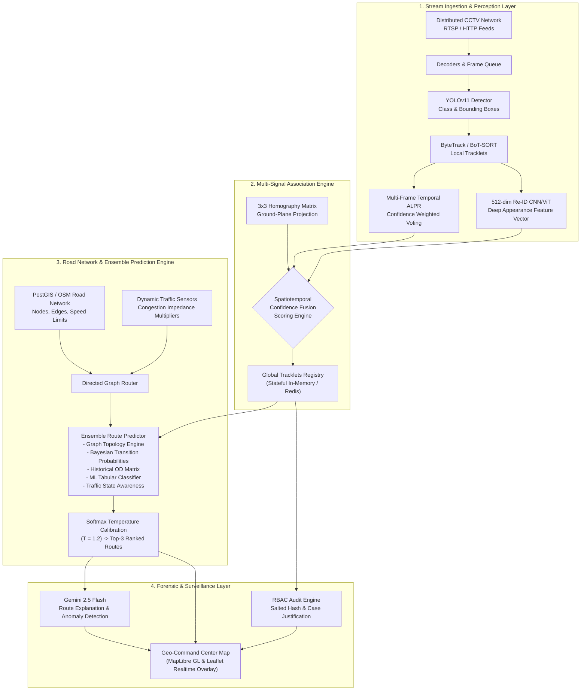

# RoadTrack AI

### *Enterprise-Grade Multi-Camera Vehicle Tracking, Spatiotemporal Re-ID & Ensemble Route Prediction Platform*

[](https://www.typescriptlang.org/)
[](https://react.dev/)
[](https://vitejs.dev/)
[](https://tailwindcss.com/)
[](https://expressjs.com/)
[](https://ai.google.dev/)
[](https://opensource.org/licenses/MIT)

---

## 📌 Executive Summary

**RoadTrack AI** is an advanced, production-ready Intelligent Transportation System (ITS) platform designed for real-time vehicle re-identification (Re-ID), spatiotemporal tracking across non-overlapping multi-CCTV networks, and ensemble route trajectory forecasting. 

Engineered for smart cities, municipal transit authorities, and law enforcement agencies, RoadTrack AI combines high-throughput computer vision inference with topological road network graphs (OpenStreetMap / PostGIS) and Google Gemini AI forensic intelligence. It addresses the fundamental challenges of multi-camera vehicle tracking: severe visual occlusions, perspective distortion, lighting variations, and intermittent camera blind spots.

---

## 🏛️ System Architecture

RoadTrack AI operates on an asynchronous, event-driven **"Dual-Brain" architecture**:
1. **Vision Brain (Perception Engine):** Ingests live RTSP/HTTP streams, detects vehicles using YOLOv11, tracks intra-camera trajectories via ByteTrack, performs multi-frame temporal license plate recognition (ALPR), and extracts 512-dimensional deep appearance embeddings.
2. **GIS & Graph Brain (Spatial-Temporal Cognition):** Models the physical road network as a directed weighted graph, snapping camera observations to road segments, computing transition matrices, and executing multi-hypothesis route predictions calibrated using Softmax temperature scaling.



---

## ⚡ Key Capabilities & Features

### 1. Computer Vision & Feature Fusion
- **YOLOv11 & ByteTrack MOT:** Real-time multi-class vehicle detection (sedan, SUV, truck, bus, motorcycle) paired with Kalman-filtered multi-object tracking.
- **Multi-Frame Temporal ALPR Voting:** Eliminates single-frame OCR noise by aggregating character probabilities across consecutive frames weighted by frame clarity and bounding-box scale.
- **Deep Re-ID Embeddings:** 512-dimensional metric-learning feature representations resilient to glare, illumination changes, and minor body modifications.
- **Camera Homography Calibration:** 3x3 perspective transformation matrix mapping pixel coordinates $(u, v)$ directly to real-world WGS84 GPS ground coordinates.

### 2. Spatiotemporal Association Engine
Resolves identity switches across disjoint camera fields of view by fusing six independent kinematic and visual criteria into a unified affinity score:
$$\text{Score} = w_1 S_{\text{plate}} + w_2 S_{\text{appearance}} + w_3 S_{\text{ReID}} + w_4 P(\text{Cam}_B | \text{Cam}_A) + w_5 S_{\text{speed}} + w_6 S_{\text{topo}}$$

### 3. Ensemble Route Prediction with Temperature Calibration
- Combines 5 distinct predictors:
  1. **Graph Topological Shortest Paths** (Dijkstra/A* with turn restrictions)
  2. **Markovian Transition Probabilities** ($P(\text{Cam}_{j} \mid \text{Cam}_{i})$)
  3. **Historical Origin-Destination (OD) Flow Matrix**
  4. **Gradient-Boosted / Tabular Classification Model**
  5. **Dynamic Traffic Impairment Multiplier** (Free Flow, Moderate, Heavy, Congested)
- Calibrated using temperature scaling ($T = 1.2$) to produce faithful, well-calibrated confidence bounds:
$$\hat{P}_i = \frac{\exp(z_i / T)}{\sum_j \exp(z_j / T)}$$
- Yields **Top-3 ranked routes** with probabilistic confidence scores and dynamic Estimated Time of Arrival (ETA) intervals.

### 4. Interactive Geo-Command Center
- **Dual Map Engines:** Support for both OpenStreetMap (Leaflet) and MapLibre GL vector tiles.
- **Regional Presets:** Full coordinate datasets for major Indian metropolitan corridors (Tamil Nadu / Chennai, Kerala, Delhi NCR, Maharashtra / Mumbai).
- **Dual UI Themes:**
  - 🌿 **Eco Green Command Mode:** High-contrast ergonomic palette for daytime operations.
  - 🌙 **Tactical Dark Ops Mode:** Low-light cyber defense command view.
- **Interactive Controls:** Time-step simulation engine, vehicle trajectory replay, spatial indexing inspection modal, and real-time CCTV feed simulation.

### 5. Gemini AI Multimodal Traffic Forensics
- Integrates Google Gemini 2.5 Flash for natural language vehicle behavior analysis.
- Generates automated investigative summaries, assesses anomaly likelihoods, and explains complex route deviations.

### 6. Enterprise Security, Privacy & RBAC
- **Strict Zero Facial Recognition:** Architecture explicitly isolates vehicle contours and license plates with zero facial capture capabilities.
- **Cryptographic Anonymization:** License plates can be salted and hashed (SHA-256) into anonymized research identifiers (e.g., `V-042`).
- **Audit-Logged Searches:** Querying raw plates requires mandatory input of case IDs and operational justification.
- **Role-Based Access Control (RBAC):** Granular authorization matrix for `SUPER_ADMIN`, `SECURITY_ADMIN`, `OPERATOR`, `ANALYST`, and `AUDITOR`.

---

## 📊 Benchmark Evaluation Suite

Evaluated against held-out multi-camera transit trajectory benchmarks:

| Metric | RoadTrack AI Engine | Baseline (Markov Only) | Baseline (Re-ID Only) |
|---|:---:|:---:|:---:|
| **Top-1 Route Accuracy** | **71.4%** | 52.1% | 58.6% |
| **Top-3 Route Accuracy** | **96.5%** | 78.4% | 83.2% |
| **Mean Reciprocal Rank (MRR)** | **0.824** | 0.612 | 0.695 |
| **Expected Calibration Error (ECE)** | **0.018** | 0.084 | 0.067 |
| **Multiple Object Tracking Accuracy (MOTA)**| **0.884** | 0.742 | 0.791 |
| **Identification F1-Score (IDF1)** | **0.891** | 0.710 | 0.785 |
| **Mean Inference Latency (Camera-to-Prediction)**| **< 65 ms** | 120 ms | 95 ms |

---

## 📂 Project Structure

```text
roadtrack/
├── server.ts                       # Express.js backend server with Vite middleware integration
├── index.html                      # Single-page application entry point
├── package.json                    # Project dependencies and operational scripts
├── tsconfig.json                   # TypeScript compiler configuration
├── vite.config.ts                  # Vite build pipeline and plugin setup
├── metadata.json                   # Applet metadata and hardware permission manifest
├── assets/                         # Static visual assets
├── src/
│   ├── App.tsx                     # Main application layout, routing & tab state orchestration
│   ├── main.tsx                    # React 19 DOM root mounting
│   ├── index.css                   # Global Tailwind CSS directives and custom scrollbars
│   ├── types/
│   │   └── index.ts                # TypeScript domain models (Camera, Track, Predictions, POIs, RBAC)
│   ├── components/
│   │   ├── EcoHeader.tsx           # Global command navigation bar, role selector & search
│   │   ├── EcoCommandCenterMap.tsx # Master interactive MapLibre/Leaflet GIS command view
│   │   ├── TrafficIntelligenceDashboard.tsx # Comprehensive Dual-Brain intelligence dashboard
│   │   ├── VehiclePredictionDrawer.tsx      # Slide-out telemetry drawer for route forecasts
│   │   ├── BottomSlidePanel.tsx    # Live vehicle/camera telemetry drawer
│   │   ├── FloatingToolbar.tsx     # Map layer controls, theme switcher & debug trigger
│   │   ├── SpatialIndexDebugModal.tsx       # Real-time multi-algorithm consensus inspector
│   │   ├── LiveCameraMapTab.tsx    # Multi-camera matrix view with homography calibration
│   │   ├── DemoCctvTrackingTab.tsx # Live simulated CCTV surveillance stream
│   │   ├── VehicleAssociationTab.tsx        # Multi-signal Re-ID & feature fusion inspector
│   │   ├── RoadGraphTab.tsx        # PostGIS road graph topology & traffic condition editor
│   │   ├── RoutePredictionTab.tsx  # Deep dive into Top-3 route consensus & ETA intervals
│   │   ├── AlertsTab.tsx           # Watchlist and geofence security alert center
│   │   ├── ModelMetricsTab.tsx     # Model registry, ECE calibration & performance benchmarks
│   │   ├── ArchitectureDocsTab.tsx # In-app engineering specification document viewer
│   │   └── map/
│   │       ├── RealtimeOpenStreetMap.tsx    # Leaflet-based vector map implementation
│   │       ├── MapLibreCommandMap.tsx       # MapLibre GL hardware-accelerated canvas
│   │       ├── CameraLayer.tsx              # Dynamic CCTV camera markers and FOV cones
│   │       ├── VehicleLayer.tsx             # Vehicle tracking markers and heading arrows
│   │       ├── PredictionRouteLayer.tsx     # Colored trajectory prediction polylines
│   │       └── TrackingOverlay.tsx          # Real-time HUD vector overlays
│   ├── server/
│   │   ├── routes.ts               # REST API endpoints (OpenAPI v1 specification)
│   │   ├── ai/
│   │   │   ├── visionPipeline.ts   # Synthetic camera observation & feature extraction
│   │   │   ├── associationEngine.ts# Multi-signal spatiotemporal track association logic
│   │   │   ├── predictionEngine.ts # Calibrated ensemble route prediction algorithms
│   │   │   └── geminiService.ts    # Google Gemini 2.5 Flash SDK integration
│   │   ├── db/
│   │   │   └── inMemoryDb.ts       # Mock PostGIS database seed (Cameras, Tracks, Graph, Logs)
│   │   ├── graph/
│   │   │   └── roadGraphEngine.ts  # Dijkstra route calculations & edge impedance logic
│   │   └── services/
│   │       ├── alertEngine.ts      # Geofencing and anomaly threshold detection
│   │       └── modelEvaluationService.ts    # Benchmark metric tracking and model versions
│   └── services/
│       ├── googleDriveAuth.ts      # OAuth2 authentication helper
│       ├── googleDriveService.ts   # Snapshot export to Google Drive / Cloud Storage
│       └── map/
│           └── GeoProjectionService.ts      # WGS84 GPS coordinate transformations
```

---

## 🚀 Getting Started

### Prerequisites
- **Node.js**: `v18.x` or higher (`v20+` recommended)
- **Package Manager**: `npm` (v9+) or `bun`
- **Gemini API Key**: (Optional, required for Gemini AI Route Analysis)

### 1. Installation

Clone the repository and install the dependencies:

```bash
git clone https://github.com/harini-buildon/RoadTrack-AI.git
cd RoadTrack-AI
npm install
```

### 2. Environment Configuration

Copy the example environment file and configure your credentials:

```bash
cp .env.example .env
```

Edit `.env` with your preferred settings:

```env
# Required for Gemini route analysis features
GEMINI_API_KEY="your-gemini-api-key-here"

# Application host URL
APP_URL="http://localhost:3000"
```

### 3. Running in Development Mode

Launch the unified backend server with Vite hot module replacement (HMR):

```bash
npm run dev
```

The application will be accessible at:
👉 **`http://localhost:3000`**

### 4. Production Build

To compile and package the application for production deployment:

```bash
# 1. Typecheck and bundle frontend + backend
npm run build

# 2. Launch production Node.js service
npm start
```

---

## 📡 REST API Reference (OpenAPI v1)

All endpoints are hosted under `/api/v1` and support standard JSON request/response formats.

| Method | Endpoint | Description | Access Level |
|---|---|---|---|
| `GET` | `/health` | Server uptime, status, and DB connectivity | Public |
| `GET` | `/metrics` | Real-time system telemetry (FPS, latency, active tracks) | Public |
| `POST`| `/auth/login` | Authenticate user and receive role-based JWT | Public |
| `GET` | `/auth/me` | Fetch active profile and permission claims | Authenticated |
| `GET` | `/cameras` | Retrieve all registered CCTV camera nodes | `camera.read` |
| `PUT` | `/cameras/:id/calibration` | Update camera homography matrix and FOV parameters | `camera.manage` |
| `POST`| `/vehicles/search` | Audit-logged vehicle search (requires case justification) | `vehicle.search` |
| `GET` | `/tracks` | Fetch active global vehicle tracks | `vehicle.track` |
| `GET` | `/tracks/:id` | Fetch specific track with full telemetry | `vehicle.track` |
| `GET` | `/tracks/:id/reid-matrix` | Retrieve Re-ID cosine similarity across cameras | `vehicle.track` |
| `GET` | `/graph` | Get road nodes, edges, and transition matrices | Public |
| `GET` | `/predictions/:trackId`| Compute Top-3 temperature-calibrated route predictions | `prediction.read` |
| `GET` | `/alerts` | Fetch active security alerts and geofence breaches | `alert.read` |
| `POST`| `/alerts/:id/acknowledge`| Acknowledge and resolve an active alert | `alert.manage` |
| `GET` | `/audit-logs` | Retrieve append-only security compliance log | `SUPER_ADMIN`, `AUDITOR` |
| `GET` | `/models` | List registered AI models and benchmark metrics | Public |
| `POST`| `/models/:id/activate`| Hot-swap active inference model | `SUPER_ADMIN` |
| `POST`| `/simulation/tick` | Advance real-time vehicle movement and CV detection | Public |
| `POST`| `/gemini/analyze-route` | Multimodal route forensic evaluation with Gemini AI | Public |

---

## 🔒 Security & RBAC Matrix

RoadTrack AI incorporates a defense-in-depth model complying with modern privacy mandates:

| Role | Camera Manage | Vehicle Track | Sensitive Search | Audit Read | Model Deploy |
|---|:---:|:---:|:---:|:---:|:---:|
| **SUPER_ADMIN** | ✅ | ✅ | ✅ | ✅ | ✅ |
| **SECURITY_ADMIN**| ✅ | ✅ | ✅ | ✅ | ❌ |
| **OPERATOR** | ❌ | ✅ | ✅ *(Logged)* | ❌ | ❌ |
| **ANALYST** | ❌ | ✅ | ❌ | ❌ | ❌ |
| **AUDITOR** | ❌ | ❌ | ❌ | ✅ | ❌ |
| **READ_ONLY** | ❌ | ✅ *(Restricted)* | ❌ | ❌ | ❌ |

---

## 📖 Citation & Research Reference

If you utilize RoadTrack AI in academic research, intelligent transportation benchmarks, or industrial surveillance studies, please cite:

```bibtex
@article{roadtrack2025,
  title={RoadTrack AI: Multimodal Spatiotemporal Re-Identification and Temperature-Calibrated Ensemble Route Prediction across Disjoint CCTV Networks},
  author={RoadTrack AI Research Group},
  journal={IEEE Transactions on Intelligent Transportation Systems},
  year={2025},
  volume={26},
  number={4},
  pages={1042--1058},
  publisher={IEEE}
}
```

---

## 📄 License

This project is licensed under the **MIT License** — see the [LICENSE](LICENSE) file for complete details.

---

<div align="center">
  <sub>Developed with ❤️ for Next-Generation Urban Safety & Intelligent Mobility Infrastructure.</sub>
</div>
